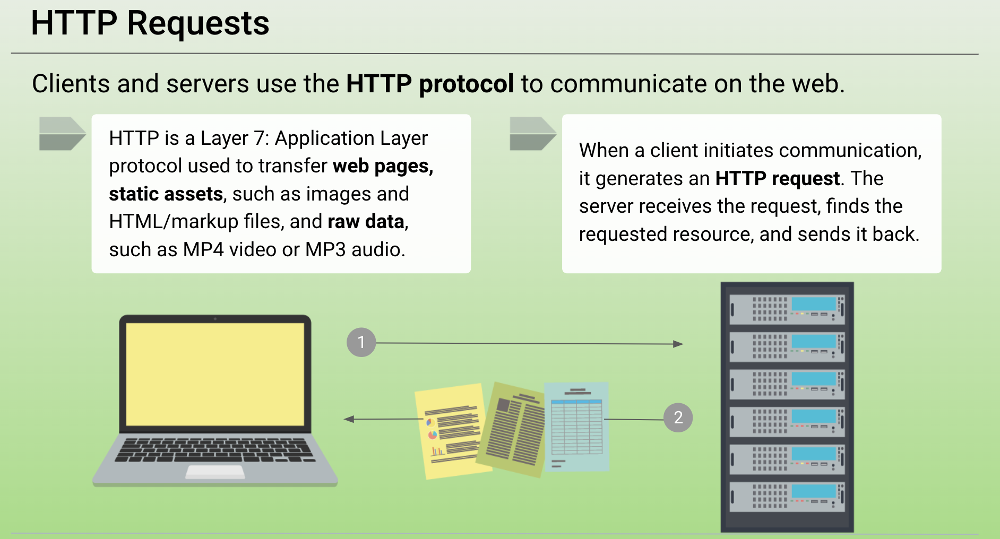
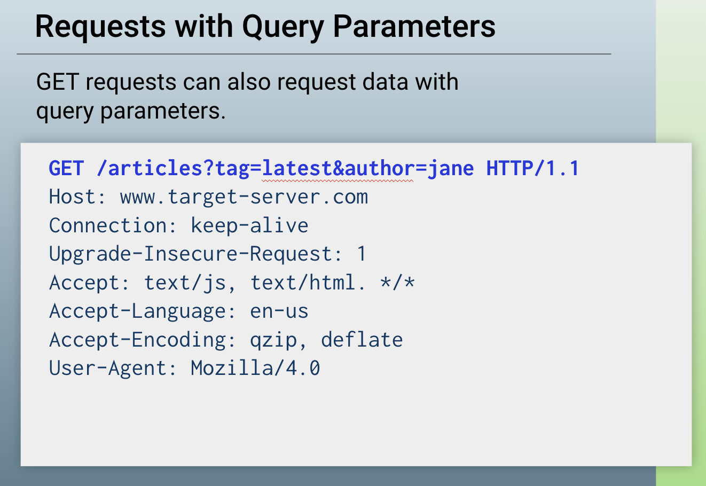
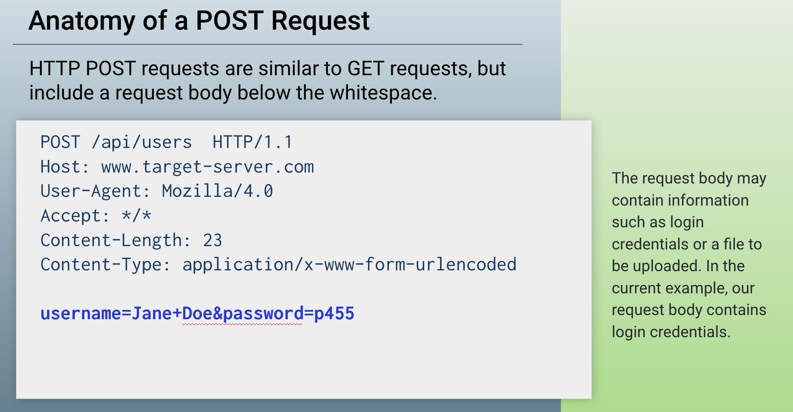
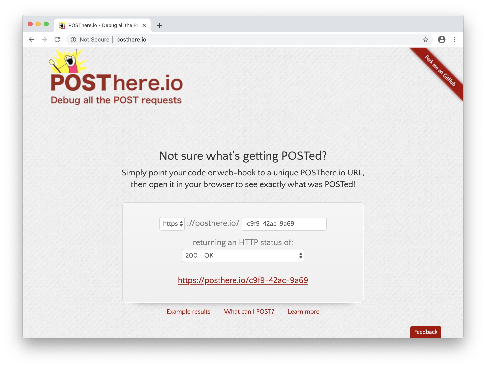
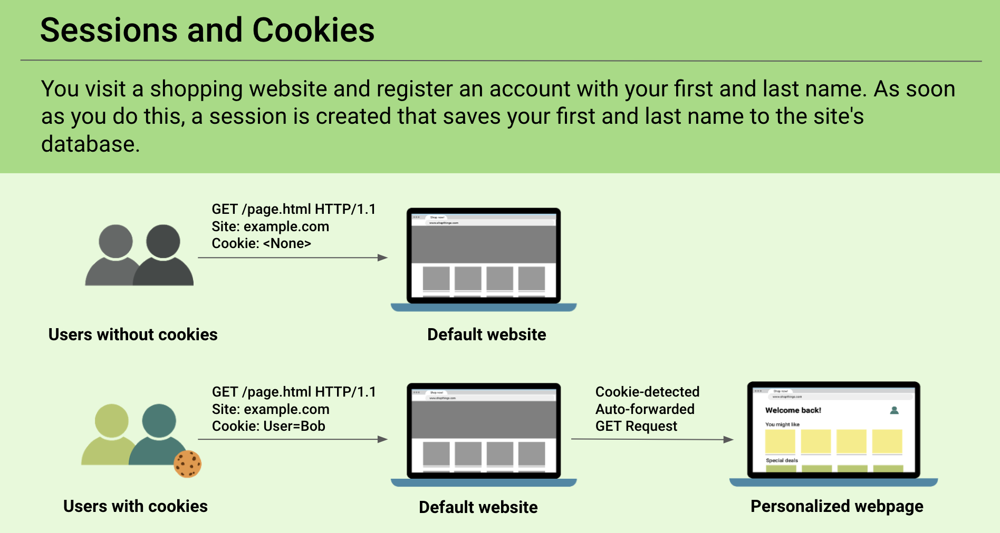
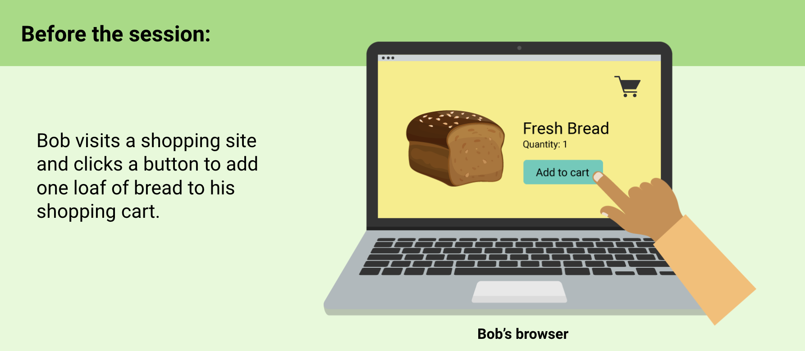
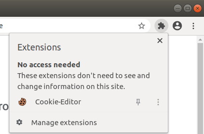

## 14.1 Student Guide: HTTP with Sessions and Cookies

### Class Overview

Today's class will introduce HTTP through the web client-server model and explore web application session management through cookies.

#### Class Objectives

By the end of today's class, you should be able to:

- Understand HTTP requests and responses. 
- Use the `curl` command-line tool to make GET and POST requests and examine the responses.
- Manage cookies using the Chrome extension Cookie-Editor.
- Use Chrome's Developer Tools to audit HTTP request and response headers.


### Lab Environment   

You will use your local Vagrant virtual machine for today's activities. 

- Student access:
    - Username: `sysadmin`
    - Password: `cybersecurity`

### Lab Setup

- Make sure that you can bring up the WordPress containers by navigating to `/home/instructor/Documents/demo` and running `docker-compose up`.

- Note the following about `docker-compose up`:

- You can run the Docker-Compose container set in the background by using the `-d`  (detach) argument with `docker-compose up -d`. This will free up the terminal to be used again after standing up the container set. You won't be able to see container status updates in the terminal if you have just used `docker-compose up`.
  - If you do this, know that you are detaching the container setup output and also that it is running in the background. 

  - :warning: **Heads Up**: Do *not* forget to run `docker-compose down` in the same directories that you run `docker-compose up`.

-  Once you are done with Docker-Compose for the day, run [`docker-compose down`](https://docs.docker.com/compose/reference/down/) to end the multi-container session.

#### :books: Additional References

- [Tutorials Point: HTTP - Requests](https://www.tutorialspoint.com/http/http_requests.htm)
- [Tutorials Point: HTTP Responses](https://www.tutorialspoint.com/http/http_responses.htm)
- [Tutorials Point: HTTP Header Fields](https://www.tutorialspoint.com/http/http_header_fields.htm)
- [Everything curl: Command Line Options](https://ec.haxx.se/cmdline/cmdline-options)
- [W3Schools: HTTP Request Methods](https://www.w3schools.com/tags/ref_httpmethods.asp)
- [ipleak.net](https://ipleak.net/)
- [curl Docs: HTTP Cookies](https://curl.haxx.se/docs/http-cookies.html)
- [curl Man Page: Cookie Option ](https://curl.haxx.se/docs/manpage.html#-c)
- [Mozilla Developer Network: Cookie](https://developer.mozilla.org/en-US/docs/Web/HTTP/Headers/Cookie)
- [posthere.io](http://posthere.io/)
- [Secureworks](https://www.secureworks.com)
- [OWASP Secure Headers Project](https://owasp.org/www-project-secure-headers/)
- [Mozilla Developer Network: Strict-Transport-Security](https://developer.mozilla.org/en-US/docs/Web/HTTP/Headers/Strict-Transport-Security)

#### Slideshow

The slides for today can be viewed on Google Drive here: [14.1 Slides](https://docs.google.com/presentation/d/1WThRiqXIG6B4TAuRHaI1zWS1gEpFG9-PLtNHFzuleT0/edit#slide=id.g4789b2c72f_0_6).

---

### 01. Welcome and Overview

:warning: **Heads Up**: This section establishes that after this unit, the rest of the boot camp will be heavily focused on offensive security and penetration testing / ethical hacking.

Know that you'll be moving from learning about implementing an ELK stack to learning about how web applications work.

After this unit, for the next three units, we will transition to focusing on penetration testing and ethical hacking. After which, we will shift back to defensive security again, with a focus on SIEM and Splunk.

#### Overview of the Web Development Unit

In our previous units, we learned about system administration and networking concepts. This week's unit will build on on those concepts as we explore how web-based communication works in the client-server model. 

This week we'll examine how we interface or communicate over the web (networking) and how websites and web applications are created and deployed (system administration).

Throughout this unit we will look at how web applications work, from both the perspective of a user and as a web developer/architect. This week's classes will cover the following:

- What happens behind the scenes when we visit a webpage.

- How websites can "remember" us through cookies and sessions.

- The architecture of web applications.

- Lastly, we will deploy and manage data in a web application.

#### Overview of Today's Topics

Today's topics will focus on examining what happens when we do typical online activities, such as visiting a website or logging into an e-commerce site. Specifically, we will look at:

- How our browsers send and receive data from a web server.

- Using our browser to dive further into the data being sent back and forth.

- Using the command line to craft, manipulate, and examine data over the web.

- And lastly, how web applications "remember" who we are.

The next unit, Web Vulnerabilities, will build directly on this week's material from a penetration testing / ethical hacking perspective. We will learn how to manipulate data over the web, allowing us to use web applications in ways developers never intended.

### 02. Intro to the Modern Web

- Know that the web is becoming more and more important for security professionals to understand. 

- Organizations are increasingly incorporating web-based applications and services, such as Salesforce, into their operations.

- Companies are beginning to move their on-premises infrastructure and services to the cloud. For example, many companies use cloud-based backup services for their servers.

- Most people access the web on a daily basis, whether for shopping or streaming videos.

A few of the major security roles that focus on web technologies:

- **Web application security engineers** must deeply understand how their company's web application works and how to secure it from attackers.

- **Penetration testers** are ethical hackers who attempt to gain privileged access to web applications by finding vulnerabilities to exploit.

- **Risk assessors** must understand the risk profiles and tolerances within web applications so that they can help companies implement best practices and policies.

The threats embedded in the modern web are constantly growing. 

- The number of users accessing the web at all times, whether through PCs, phones, or other devices, is constantly growing.

- The collective amount of personal data that is stored on the web is growing exponentially.

- Many attackers want to steal this personal data so that they can sell it.

- The web represents most organizations' largest attack surfaces.

It is now common to hear about security breaches in the news. It's up to security professionals to develop strategies and engineer solutions to secure the modern web.

### 03. HTTP Requests and Responses

Securing the modern web requires knowledge of the following topics. You should have preliminary knowledge of these from previous units:

- Client-server architecture
- HTTP (HyperText Transfer Protocol)
- HTTP requests
- HTTP responses

The internet is a massive network connected by countless smaller networks, which all communicate through HTTP.

- Attackers can leverage the HTTP protocol and the growing number of web-connected organizations and users in order to compromise systems and gather sensitive data.

Before we explore the HTTP protocol in detail, let's look more closely at client-server architecture.

#### Client-Server and HTTP

The exchange of information through a cycle of requests and responses between clients and servers is known as the **client-server model**.

Recall that we've covered the client-server model before in the Networking unit. For *this* unit, we're specifically going over web-based client-server models.

The typical client-server communication is as follows:

1. A user's device (the client) communicates with a server in order to request resources from it.
2. The server queries the resources from the internal servers it is connected to.
3. The server sends a response back to the client.
 
  

In order for clients and servers to communicate over the web, they must use the **HTTP protocol**.

- HTTP is an OSI Layer 7: Application Layer protocol that websites and web applications use to communicate with user devices.

- HTTP is used to transfer webpages, static assets such as images and HTML/markup files, and raw data, such as MP4 video or MP3 audio.



When a client, such as a web browser, initiates communication, it generates an **HTTP request**. The server receives the request, finds the requested resource and sends it back.

There are various types of requests, known as **HTTP methods**, which indicate the specific actions between the client and server. For example:

- A user can request data from a server, e.g., "I'd like to see my friend's photos on Facebook."
- A user can give data *to* a server, e.g., "Here are my credentials for my LinkedIn account."
- A user can update data on a server, e.g., "I'd like to reset my Zoom password." 

#### HTTP Request Methods

Below are the various HTTP methods. 

| HTTP Method | Description                                                  |
| ----------- | ------------------------------------------------------------ |
| GET         | The GET method requests data *from* a server. Requests using GET should only retrieve data. |
| HEAD        | The HEAD method is identical to GET except that the server does not send the response body.|
| POST        | The POST method sends data *to* the specified resource, often changing or updating the server. |
| PUT         | The PUT method replaces or updates resources with the request payload. |
| DELETE      | The DELETE method deletes the specified resource from the server            |
| CONNECT     | The CONNECT method establishes a tunnel to the server. |
| OPTIONS     | The OPTIONS method describes the communication options for the specified resource. |

We will focus on the two most common methods: GET and POST requests. We'll also briefly use HEAD, PUT, and OPTIONS in the activities.

Examples of the following GET and POST requests:

- GET request: When you open a browser and go to amazon.com, the HTTP client (your browser) asks to GET the data that the URL (amazon.com) points to. That data is their webpage.

- POST request: Once your browser goes to amazon.com, you need to log into your Amazon account. The client sends a POST request that contains your credentials for logging in.

Quickly review what some of the other methods are used for:

- The HEAD request is similar to GET, but has the server only return HTTP header information. A server reponse to a HEAD request should not return a response body.

- The PUT request is similar to POST, in that it sends information to a server. However, it is used to overwrite resources, such as updating part of a webpage.

- The OPTIONS request asks the HTTP server to send all the methods it can respond to.

#### The Anatomy of HTTP Requests and Responses

An HTTP request looks like this:


- A **request line** contains the request method, the name of the requested resource, and the version of HTTP in use.
  - The request line can also contain **query parameters**, which the client can use to send data to the server.

- **Headers** contain additional details about the requested resource. They are used to implement many actions with security implications, such as authentication and remembering user resources.
  - There are many different types of headers, and you aren't expected to remember them all.
  - We’ll see the most common headers as we continue to explore requests and responses. Links to reference documentation will be provided, which you can use for their own research later.
- **Whitespace** is a blank line indicating the end of the request.

Once the server receives the request, it returns an HTTP response that looks like this:


- A **status line** contains the response status code and translation, such as `OK` or `Conflict`.

- **Headers** contain additional information about the response, similar to response headers.

- Whitespace (a blank line) separates the header from the response body that follows.  
- A **response body** contains the resource requested by the client, all of the web code and styling that your browser uses to format the page.

#### HTTP Requests

In the upcoming examples, we're going to specifically look at a GET and POST request.

GET requests are often used for receiving information from an HTTP server, and POST requests are often used for sending information to an HTTP server.


- The request line:
  - `GET`: The request method.

  - `/js/analytics.js`: The requested resource. This resource is the file path from a domain stated in the header (`Host`).

  - `HTTP version 1.1`: The protocol version used by the browser.

- The header section:

  - `Connection: keep-alive`: Tells the server to keep open the TCP connection used for this HTTP transfer after sending the response.
    - This allows the client-server to reuse the TCP connection for later HTTP requests.
    - The alternative is performing a TCP handshake: opening a connection, transferring the request and response, closing the connection, and repeating for each request response cycle.
    - Since HTTP usually involves a series of requests and responses, this would result in slower transfers than simply reusing the connection.

  - `Host: www.target-server.com`: Contains the domain name of the target server.
    - **Note:** The protocol (HTTP) + the host + the file path in the request line creates the URL we see in the browser: http://www.target-server.com/js/analytics.js

  - `Upgrade-Insecure-Requests: 1`: Tells the server to turn this HTTP connection into HTTPS, which will encrypt the response and all further communications.

  - `Accept: text/html/, text/js, */*`: Tells the server that the client expects to receive a JavaScript or HTML document in response (`text/html, text/js`), but will accept data of any type (`*/*`).
  - `User-Agent: Mozilla/4.0`: Tells the server that this request is coming from a Mozilla 4.0 browser.

- Some other common request headers are:

  - **Authorization**: Contains the credentials used to authenticate a user with a server.

  - **Referer**: Contains the address of the previous webpage from which the currently requested page was linked. This header allows servers to identify where people are visiting from, and may use that data for analytics, logging, or optimized caching.  
    - If a link from a Google search led to the current page, the referrer is Google.
  - **Cookie**: Contains stored HTTP cookies previously sent by the server with the **Set-Cookie** response header. We will cover these in more depth later.

GET requests can also request data with query parameters.

- Query parameters are useful for specifying which parts of a resource to receive or send data to.

In the following example, the GET request specifically requests articles with two distinct parameters: the `latest` articles, created by author `jane`.



- The request line contains the specific parameters: `/articles?tag=latest&author=jane`

The general syntax for query parameters is `[path]?[firstParam]=[value]&[secondParam]=[value]`.

- There is no limit to the number of query parameters a user can send using GET requests.

Next, a POST request:



POST requests are used to send data to a server.

- The structure of an HTTP POST request is similar to a GET request, but includes a **request body** below the whitespace.

- The request body may contain information such as login credentials or a file to be uploaded. In the current example, our request body contains login credentials.

#### HTTP Responses

Now, we will look at the HTTP responses to GET and POST requests.

- The responses will look very similar to the requests. They both contain response headers and often a response body.

An example HTTP response :


- In the status line:

  - `HTTP/1.1`: The unencrypted protocol is in use.

  - `200 OK`: Status code showing that the request was processed properly.

- In the response headers:

  - `Date`: Contains a timestamp of when the response was generated.

  - `Server: Apache/2.4.7 (Ubuntu)`: Indicates the server is running Apache 2.4.7 on Ubuntu.

  - `X-Powered-By: PHP/5.5.9-lubuntu4.21`: Indicates the server is running PHP version 5.5.9 on Lubuntu with kernel version 4.21.

  - `Set-Cookie: SESSID=8toks; httponly`: Tells the client to create a cookie called `SESSID` with the value `8toks`, and that this cookie can only be set by the server with HTTP. We'll discuss cookies and `httponly` in greater detail later.

- Below the response headers is a blank line followed by the response body, which is, in this case, the source code for the file `/js/analytics.js`. 

  - Knowing exactly what this file is is not important right now, but it is important to recognize that it is in the response body.

Status codes:
- 200 codes indicate success.
- 300 codes indicate multiple choices, meaning the server can respond to the request in more than one way.
- 400 codes indicate client errors, meaning the client sent an improperly formatted request.
  - 404 is a common example of a 400 code, indicating that a webpage doesn't exist or can't be accessed.
- 500 codes indicate server errors, meaning the server application failed somehow.

:books: A standard reference site for general headers and web information is the [Mozilla Developer Network](https://developer.mozilla.org/en-US/docs/Web/HTTP/Headers).

#### Key Takeaways

We just covered a lot of new information about HTTP requests and responses. Briefly review the main takeaways:

- HTTP requests are sent from an HTTP client to an HTTP server.
- HTTP responses are sent back from the HTTP servers as a response to the client.
- HTTP requests include a request line, a request header, and an optional request body.
- HTTP responses include a status line, a response header, and usually a response body.
- Query parameters allow you to be specific about the parts of a resource you want to send or receive data from.
- GET requests ask an HTTP server for resources, such as a whole webpage.
- POST requests send data to an HTTP server's resources, such as login credentials or images for a webpage.
- PUT requests also send data to an HTTP server, but are often used to overwrite resources, such as updating a part of a webpage.
- OPTIONS requests ask an HTTP server to respond with all HTTP methods that the HTTP server is programmed to respond to.

### 04. Activity: HTTP Requests and Responses

- [Activity File: HTTP Requests and Responses](Activities/04 - HTTP_Requests_Responses/Unsolved/README.md)
- [HTTP Reference Sheet](./Activities/04 - HTTP_Requests_Responses/Unsolved/HTTP_Reference.md)


### 05. Activity Review: HTTP Requests and Responses


- [Solution Guide: HTTP Requests and Responses](Activities/04 - HTTP_Requests_Responses/Solved/README.md)


### 06. Using DevTools to Examine HTTP, Cookies, and Security

In the last activity we took a close look at HTTP response and header examples.

In this next section, we are going to deconstruct and examine a web application using the native tools within a browser. This allows a security professional to:
- Understand the request and response flows between an HTTP client and server.
- Examine the security implementations of a website through its response headers.
- Identify where cookies are used in the HTTP request-response cycle.

#### Chrome Developer Tools Demo

Chrome's Developer Tools will be used to facilitate this process.

Remember that a web browser is a type of web client.

Open Chrome, click the three vertical dots in the top-right of the browser window. It will reveal a dropdown menu. Click **More Tools**, and then **Developer Tools**.

- :books: The following URL can be used to learn more about Chrome Developer Tools: 
  - [Chrome DevTools](https://developers.google.com/web/tools/chrome-devtools)

Developer Tools are a set of tools that allow people to audit the requests and responses that are handled by the browser.

- Some more info on the different tabs:

  - The **Elements** tab shows the design components that the webpage is comprised of. This is sent to the client in the response body.

  - The **Applications** tab can be used to see the cookies saved by your client. We'll cover cookies more in depth later.

For the purpose of this class, we'll only be looking at the **Network** tab.

- Click on the **Network** tab. This tab is where we'll find the different requests and responses processed by our client, or in this case, the Chrome browser.

For our demo we'll be looking at the website of a well-known managed security provider, SecureWorks.


- Navigate to secureworks.com.

  - We can see, in real time, all the resources that we're requesting from visiting their main page.

- On the left-most column in the a Network tab, we can see our browser's initial GET request and the server's response.

- In the **Name** column, click on the the first www.secureworks.com request-response.

DevTools will show us both the request and corresponding response for this page.

- Make sure the **Headers** tab is selected and scroll to the bottom. The **Request Headers** section.

This section shows us all of the request headers from when we first requested this page.

- The request header **Upgrade-Insecure-Requests**. This request header tells the HTTP server that it prefers to communicate through HTTPS over HTTP.

- This is one of few request headers a user can use to protect themselves. It is then the responsibility of the HTTP response headers to ensure HTTP communications are protected.

- This means that web application developers are responsible for ensuring strict security policies.

Scroll up to the **General** section, which shows the status code, request method, and remote address.

  - We can see the standard 200 OK response **Status Code**.
  - The **Request URL** points to the **Remote Address**, according to our DNS records.

Scroll down the **Response Headers**. 

  - The **Server** response header tells us the kind of web server that is sending the HTTP response to our client. Microsoft-IIS is Microsoft's implementation of HTTP, like Apache or nginx.

  - The **set-cookie** cookies are set here. The **ANALYTICS** cookie is likely a tracking cookie used by advertisers and data collectors. 

  - The **Strict-Transport-Security** header tells the HTTP client that it should use HTTPS over HTTP.

In their next activity, we will inspect the headers for the site CrowdStrike in order to find various points of information.

### 07. Activity: Inspecting with Developer Tools 

- [Activity File: Inspecting with Developer Tools](Activities/07 - Dev_Tools/Unsolved/README.md)

### 08. Activity Review: Inspecting with Developer Tools 

- [Solution Guide: Inspecting with Developer Tools](Activities/07 - Dev_Tools/Solved/README.md)

---

### 09. Break

---

### 10. Using `curl` 

Remember that browsers are not the only way to interact with web servers. 

There will be cases when access to a web server is required, but there is no website with navigation links or visual UI.

#### Managing HTTP Requests and Responses in a Repeatable, Programmatic Way

It's not always possible to examine HTTP requests and responses through a browser:
- Sometimes the tools you can use to send and receive HTTP requests are limited.

- For example, when working through a container that has no user interface, you'll need a command-line tool to send and receive HTTP requests.

Cybersecurity professionals need to be able to quickly test HTTP requests in a way that can be automated, but also allows them to make adjustments as they work.

- There is a command-line tool called `curl` that allows security professional to do exactly this.

:warning: Know that there will be a bonus challenge section in the homework involving `curl`.

#### Introducing curl

**`curl`** is a command-line client that allows us to send data to and from servers. In a security context, we can use it to send customized HTTP requests that allow security professionals to:

- Test web server security configurations.
- Ensure web servers don't leak sensitive data through their HTTP responses.
- Verify that servers only respond to certain request types.
- Look for vulnerabilities on a web server.

You'll frequently switch between using the browser and using `curl` when auditing web applications.

And of course, as a command-line tool, `curl` can be used in conjunction with other command-line tools, such as `grep`, `sed`, and `awk`.

We'll demonstrate `curl` with the website posthere.io.

- Open your browser and navigate to https://posthere.io.

- When we used the browser to navigate to the site, it sent a GET request to the posthere.io server. The response produces the webpage we see now.

The HTTP response body contains all of the web code and styling that your browser uses to format the page.

- Right-clicking anywhere on the page, and clicking **View page source**.

- Scroll down to the very bottom of the page and note the last HTML tag.

We don't need to know exactly how HTML works. But when we use `curl`, we should expect to see the same HTML tags at the end of the response body.

#### Standard curl Usage

We'll first look at the most basic type of `curl` request.

- Open a terminal and run `curl https://posthere.io`.

 - Running `curl` with only a URL executes a basic GET request. What we get in return is all of the web code that displays and styles the page in our browser.

 - The response body. Note the `</html>` tag at the end of the `curl` response. It is the same tag we saw in our browser.

Scroll up to the response header area and note the status code.

- As security professionals, you will often need to find the status code in HTTP responses.

- We can use `curl` to more easily examine the status code and response headers.

#### Using curl to View Headers

Looking at response headers can give additional information about how an HTTP server is responding to requested data.

Running `curl` with the `--head` flag will only show the response header.

- Run `curl --head https://posthere.io` and note the status line, `200 OK`, and key response headers, such as `Content-type` and `Server`.

  ```console
  HTTP/1.1 200 OK
  Server: nginx/1.9.2
  Date: Thu, 12 Mar 2020 06:02:20 GMT
  Content-Type: text/html
  Content-Length: 12905
  Last-Modified: Wed, 01 Jan 2020 17:09:18 GMT
  Connection: close
  ETag: "5e0cd23e-3269"
  Accept-Ranges: bytes
  ```

- The `Content-Type` response header (`text/html`) tells our client (`curl`) that it is receiving a response body with the resource type HTML. This header serves the same purpose as a file name extension in your operating system.

- The `Server` response header tells our browser it is connecting to an `nginx` web server, one of the most popular HTTP servers.


#### Creating a POST Request with Query Parameters

A POST request is used for sending data to an HTTP resource.

Unlike a regular GET request, which returns the entire response body, POST requests need to specify *where* you want to send information to.

- Open a browser and navigate to https://posthere.io. This site will help us customized POST requests.

- Click on the red underlined URL on the homepage.  
  - :warning: **Heads Up**: Your URL will be slightly different, which will change the example URLs as well.

  

- We can send POST requests to this temporary page URL.

Since we aren't using a standard GET request, we'll now need the `-X` option to specify that we are changing the request method, followed by the type of method that we want to use in our request (POST).

- Type: `curl -X POST https://posthere.io/f260-48d9-8e1b`

  - `-X`: Indicates that we are using a method other than the default GET.
  - `POST`: The method we are using.
  - `https://posthere.io/f260-48d9-8e1b`: Our unique URL that the page gave us. Everyone who uses the site is given a different URL.

We need to designate an area on the webpage to send information. We can do this with query parameters.

- We'll add the following string to the end of the POST request: `?query=parameter`.

- Run `curl -X POST https://posthere.io/f260-48d9-8e1b?query=parameter` and refresh the page to see the query parameter.


#### Creating a POST Request with Plain Data

Another way to POST data to a page is by using the `-d` option. The `-d` option can POST raw text data to an HTTP resource through the request body.

- Type `curl -X POST -d "test data" [URL]`, replacing `[URL]` with your page's URL.

  - `curl`: The tool we are using.
  - `-X`: Indicates that we are using a different method than the default GET.
  - `POST`: The method we are using.
  - `-d`: Sends the data in a POST request to the server.
  - `"test data"`: The message we are sending.
  - `https://posthere.io/f260-48d9-8e1b`: The unique URL that the page gave us.

- When we run the command we should expect to see "test data" show up on the webpage.

- Run the command to send the POST request. Then refresh the page to verify the results.


#### Creating a POST Request with JSON Data

Now that we understand how to send data using a POST request, we can begin to examine how cyber professionals use these tools in their daily work.

 - Usually, when professionals interact with data on webpages, the data is formatted as structured JSON data. 

- While we don't need to know the specifics of JSON data at this time, we should understand how to send it in a request.

Now, we'll create a POST request to upload structured JSON data. We'll use a new header option: `-H`.

- Type the following command into the terminal:  

  `curl -X POST -d "{\"jsonKey1\": \"jsonValue1\", \"jsonKey2\": \"jsonValue2\"}" -H "Content-Type: application/json" [Your URL]`  
    - Be sure to replace `[Your URL]` with the URL you got from the posthere.io homepage. 

- This command tells the server that we are sending it JSON data with the `-H` option, followed by `"Content-Type: application/json"`.

- Refresh the page to show the beautiful JSON data POST-ed to it.

  

We just covered how to POST structured JSON data to an HTTP resource using the `-H` header option and `"Content-Type: application/json"`.


### 11. Activity: Using curl

- [Activity File: Using `curl`](Activities/11_Using_cURL/Unsolved/README.md)

### 12. Activity Review: Using `curl` 

- [Solution Guide: Using `curl`](Activities/11_Using_cURL/Solved/README.md)

### 13. Sessions and Cookies

Web client-server architecture assumes clients and servers communicate via discrete, individual requests in order to exchange resources.

- HTTP resources are inherently **stateless**, meaning that whenever your browser requests a webpage, there is no way for that webpage to distinguish you from anyone else.

Websites need a way to deliver content that is specific to each user. To do so, they establish **sessions**, with **cookies**.

- Sessions are unique server-side sets of user data that are used to customize webpages depending on the specific user accessing them.

- Cookies are small pieces of text data that, when sent by an HTTP server's response header, are saved by the user's HTTP client.

#### Session Example

Use the following example of a session:

- You visit a shopping website and register an account with your first and last name. As soon as you do this, a session is created that saves your first and last name to the site's database.

- This happens in the background, since you can't see the database actively saving your information. But you can see evidence of this action when you return to the site and are greeted with the following message: "Welcome back, [first name] [last name]! Are you ready to continue shopping?"

In this scenario, the session information was saved to a database, which was then linked to a unique cookie. That cookie was then sent to your client (or browser) in the HTTP server's response header. Your client then saved that cookie locally and sends it back through a request header whenever you visit the site.

To summarize: 

- A session contains user-specific information that is saved in order to personalize an HTTP response.

- A cookie has information that uniquely identifies each session.

- The cookie is created by the HTTP server and sent to an HTTP client through a response header.

- When the HTTP server sends the client the cookie, it also sends back the personalized response body.

- The HTTP client receives the cookie, saves it, and processes the personalized response body.

- On future requests to the HTTP server, the HTTP client will send the cookie back to the HTTP server so that a personalized response body and cookie can be received in return.

Using a basic example of a cookie changing how a user views a site:

 

Because the second user has a cookie, when they request the webpage, the server forwards them to a new, personalized webpage, which continues their session.

#### A Basic Single Cookie Session

Let's look at one more example:

Starting with this slide, follow the process of a single cookie session:

  


1. Bob visits a shopping site. It is a default page with a list of products Bob can buy.

2. Bob decides to buy an item and clicks a button to add it to his shopping cart. This button is set up to send a POST request to the HTTP server that includes the data of the recently added item.

3. When the website receives this request, it tells the database to create a unique cookie and link it to Bob's shopping session. 
   - The session in the database now stores a list of all the items in Bob's cart. This is Bob's unique session.

4. The HTTP server then retrieves Bob's shopping cart session from the database and responds back to Bob's client with `Set-Cookie: cart=Bob` in the response header, and a response body containing Bob's newly updated cart contents.

5. Bob's client saves the new cookie locally.

6. Any new request made by Bob's browser will send the cookie back via a request header (`Cookie: cart=Bob`) to the HTTP server.

Cookies can be set and read by JavaScript, a powerful web-based programming language that is often used by attackers in various kinds of attacks, such as cross-site scripts, clickjacking, and session hijacking. We will be covering these types of attacks in more detail in a later unit.

#### Session ID Cookies

Implementations of sessions and cookies will vary by site. While it isn't necessary for you to know the details of every cookie type, we will cover the difference between an insecure cookie and a secure cookie.

The following type of cookie is a session ID cookie. In a database, this cookie is still unique to each user's session, but it is vulnerable to tampering and spoofing.

Let's consider the example of our shopper, Bob. If his account was the fifth account to ever be created on the shopping website, his cookie might look similar to the following:

- `Set-Cookie: Session-Id=5`

- In this case, an attacker can simply change their cookie's value so that when they make a request to the site, they do it as the user Bob.

Modern versions of session cookies now contain uniquely hashed values specific to each user.

- The hashed data may consist of multiple things that identify the user, such as their first name and last name.

- The servers may also include salts in the hashing process, to add even more complexity.

- For example: `Set-Cookie: Session-Id=299367cd4c0e2c6d3ae6e09eda4e0590`

It's relatively difficult to reverse engineer the contents of unique session ID cookies created with modern implementations.

- However, these cookies are still vulnerable to attacks such as cross-site scripts or man-in-the-middle attacks, which we will cover in a later unit.

- Instead of an attacker needing to figure out how to create a cookie that looks like another user's, they can simply steal it from them.

To summarize:

- A cookie is used to implement a user's session.

- A client and server exchange cookies through headers.

- Clients save cookies locally.

- A client sends a cookie via the Cookie header.
- A server sends a cookie via the Set-Cookie header.
- Bad implementations of cookies can be spoofed or stolen, and cookies with modern implementations can be stolen.

#### Demo: Sessions with Cookie-Editor

For the activity, you will be using the Chrome extension Cookie-Editor to see how cookies and sessions work in their browser.

**Cookie-Editor** is an extension that works with Google Chrome to let us:
- Import users' cookies.
- Export users' cookies.
- Save users' cookies.

We will be covering the following steps:

- Enable the Chrome extension Cookie-Editor.
- Create a user on a webpage and export their cookie to the clipboard with Cookie-Editor.
- Create a new user, which will overwrite the old user's cookie as well as their session.
- Use the Cookie-Editor extension to import back the first user's session to show how a simple tool can be used to swap sessions.

#### Setting Up Bob's Session

First, we'll need to pin the Cookie-Editor extension. 

- Launch **Google Chrome** by clicking on the bottom-left finder in Ubuntu and type "Chrome." Click **Google Chrome** to launch it.

- After Chrome is launched, go to the top-right puzzle icon and click the pin icon next to Cookie-Editor to add the extension to your browser bar.

- 

  - :warning: **Heads Up**: If the Cookie-Editor extension **does not** show in the browser bar shortly after launching Chrome, you'll need to install the extension by going to the following URL in Chrome: https://tinyurl.com/r48fosk and clicking **Add to Chrome**.

- Note the cookie icon to the right of the URL bar.

Cookie-Editor allows users to import and export cookies.

- Navigate to httpbin.org/#/Cookies/get_cookies_set and scroll down to the **GET /cookies/set** location.

- Click **Try it out**.

- Enter "Bob" in the **Description** field and click **Execute**.

We have now saved a cookie that contains "Bob."

#### Exporting Bob's Cookies

- Click the Cookie-Editor icon and click **Export** on the bottom-right.

- The cookie is now saved to our clipboard.

#### Setting up Andrew's Session and Removing Bob's Cookie

- Scroll back to the **GET /cookies/set** area where you set your cookie.

- Set the **Description** to "Andrew" and click **Execute**.

- Scroll up and the the first **GET /cookies** section and click **Execute** to show that the page now associates to a cookie called "Andrew."


#### Turning Andrew's Session Back into Bob's

We'll now re-assume Bob's cookie with Cookie-Editor.

- Click Cookie-Editor and click the **Import** button to the left of the **Export** button.

- Paste the contents of the cookie:

    ```JSON
    [
        {
            "domain": "httpbin.org",
            "hostOnly": true,
            "httpOnly": false,
            "name": "freeform",
            "path": "/",
            "sameSite": "unspecified",
            "secure": false,
            "session": true,
            "storeId": null,
            "value": "Bob"
        }
    ]
    ```


- Click the bottom-right button to import Bob's cookie and you should see a "Cookies were created" notification.

#### Verifying We're Bob Again

- Finally, click **Execute** again at the **GET /cookies** section to see that we're once again Bob.

  

For our upcoming activity, we are going to use Cookie-Editor to swap sessions between two users with different administrative access levels, to see how web servers handle data and authentication differently for both users.

This activity will also show how an attacker can use stolen cookies to assume a victim's session. It won't show the actual process of exploiting a vulnerability to steal the cookie, but it will show how the session swapping works.

### 14. Activity: Swapping Sessions Activity

- [Activity File: Swapping Sessions](Activities/15 - Swapping_Sessions/Unsolved/README.md)

### 15. Activity Review: Swapping Sessions

:warning: Note that we'll be building off of this activity for the bonus homework challenge.

The goal of this activity was to demonstrate how a cookie ties to a session and how a session's cookies, if compromised, can be used to hijack someone's session.

---

© 2020 Trilogy Education Services, a 2U, Inc. brand. All Rights Reserved.  
