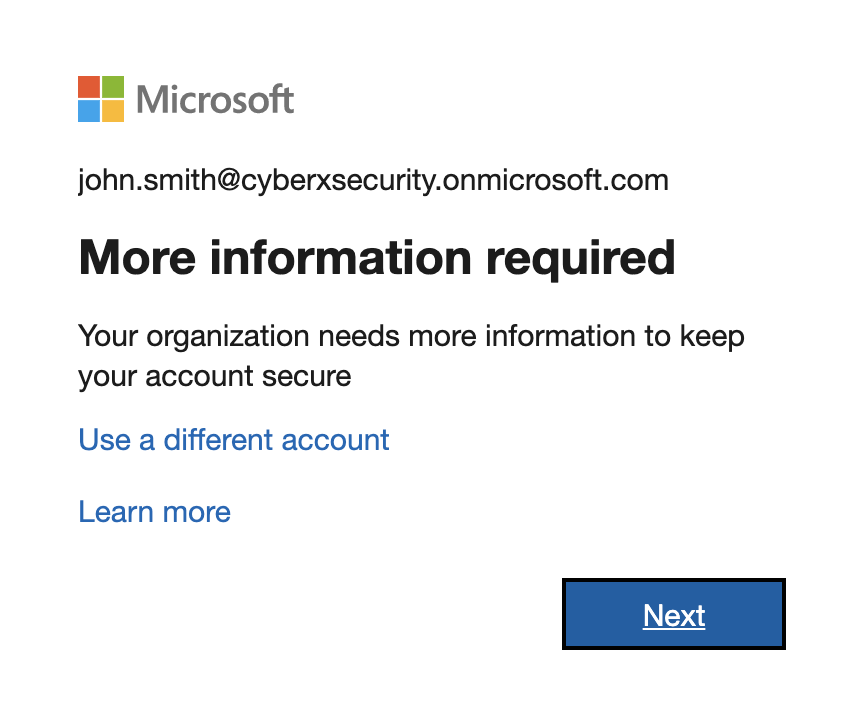
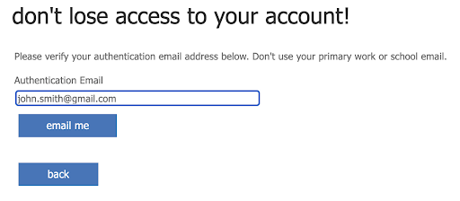
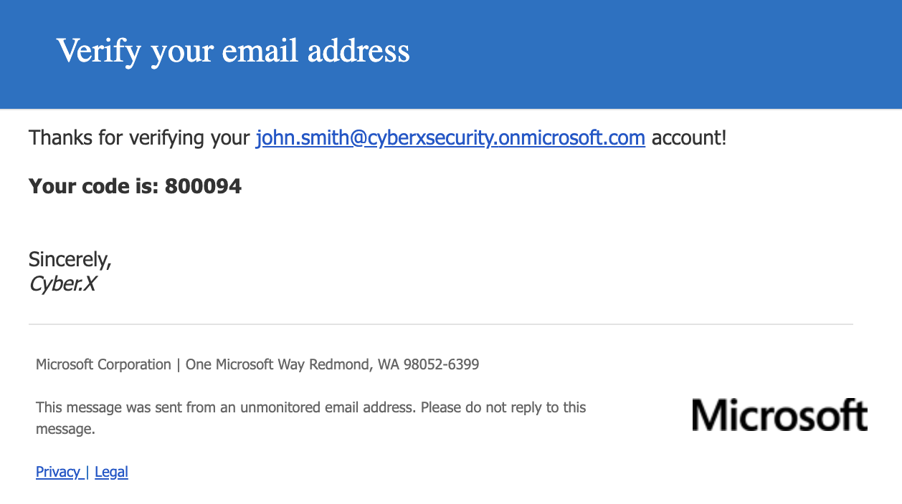

### Lab Access Guide

In this guide, you will learn how to get set up on Azure lab services and get access to the first of several custom lab environments that you will use in this program.

Before you get started, please make sure you have the following:

* Your Azure registration link. This is the same for everyone in the class, and you will need this link to get access to the custom Windows lab environment we will be using in class. Please reach out to your instructor if you don't have this.
	* **IMPORTANT**: You must use this link when getting set up on Azure. DO NOT use `labs.azure.com`
* Your Azure log-in credentials, which includes a custom Microsoft email. Please reach out to your instructor if you don't have this.

* In order to connect to your lab, you will need to use a tool called **Remote Desktop Protocol (RDP)**. RDP allows you to log into and interact with a remote machine just as you would your normal laptop or desktop. In order to use RDP, you must install an RDP Client. If you have not installed it yet, access the RDP Clients at the following links:
	* [macOS RDP Client](https://apps.apple.com/us/app/microsoft-remote-desktop-10/id1295203466?mt=12)
	* [Windows RDP Client](https://www.microsoft.com/en-us/p/microsoft-remote-desktop/9wzdncrfj3ps?activetab=pivot:overviewtab)

* RDP log-in credentials. This will be the same for everyone:
	* **Username**: `azadmin`
	* **Password**: `p4ssw0rd*`

### Instructions

* Open a web browser and navigate to the custom Azure labs link provided to you.

* Log in using your provided Azure Active Directory credentials.

	* :warning: **Important:** You will be asked to create a new password.

* Once logged in, you will next set up self-service password resets. This means that you will be able to reset your password if you lose or forget it. You will be asked for your personal email, which will be used as the recovery email address in case you forget your password.  You will not receive any unsolicited emails. 

	

	When you click "Next", you'll be met with a page asking you to set up an Authentication Email. Select "Set it up now"

	

	Here, you'll provide your preferred email address - this will be the email that is used if you forget your password.

	

	You'll need to click "Email Me" to receive the confirmation email. This will send an email to the address you've provided, the email will come from "msonlineservicesteam".

	The email that you receive should look something like this:

	

	You'll enter the code that you received into the Azure page and select "Verify".
	
	
	
	Once you've done this, you'll see a green check mark at the bottom, and you can now select "Finish"

	

* Now you'll be able to load the dashboard, and you will see a card titled **Windows**. This contains the lab environment you will use for the upcoming Windows week. The remaining lab environments will be added as class progresses, and following the Windows week, you will next use this Azure account for the Network Security unit.

	* *Note*: Each new lab environment will have a different registration link, which will be provided to you in class at later dates. When you first click a new registration link, the lab will be available in the dashboard for the rest of the course.

	* *Note*: For the Cloud Security and Project weeks, you will be using your own personal Azure accounts that you will create. More information will be provided in Unit 11.

* Lab environments must be turned on prior to use. Generally, they will turn on automatically approximately 30 minutes before class starts, and shut off automatically approximately 15 minutes after class ends. In some cases, your instructors might adjust these settings so please consult with them as to when your specific class labs are set to start and shut down.

	* This means that you will not have to manually start labs to use them in class, but you will need to start them manually should you wish to use them at home.

* Starting and stopping a lab is as simple as clicking the **Start/Stop** button in the bottom-left of the card.
	* *Note*: In this case, your lab has already been started since you just got set-up on it.

#### Connecting with RDP

* Next, you must download an RDP file, which contains the information that the RDP Client application needs to connect to the lab environment. Click the monitor icon in the bottom-right of the lab card, and select **Connect with RDP**.

* This will download a new RDP file, simply click on the RDP file, and it will automatically open the Client, and prompt you for a password.
	* (After you've gone through all the instructions in this document and are fully set up, please create a new folder in your local computer's `~/Documents` directory, such as `ClassLabs`, in which you will save all of your RDP files.)

* Use the credentials below.
	*  **Username**: `azadmin` OR `~\azadmin`
	*  **Password**: `p4ssw0rd*`

* Click **OK** on the prompts raised by the RDP Client; you will see that logging in brings you to a completely different Windows desktop environment.

	* All of the lab environments consist of one or more VMs running _inside_ of a Windows host, using a technology called _Hyper-V_. In other words, you will connect to a Windows computer, which contains several VMs inside of it. This is why you will always connect to a Windows machine, despite many of the labs involving the Linux operating system and/or multiple VMs on a virtual network.

	* Specifically, you will access the VMs on the virtual network by using the **Hyper-V Manager**, which is an application that provides easy access to all of the VMs running inside the host.

* To access the virtual machines, click the **Search** bar in the bottom-left of the screen, and type: `Hyper-V Manager`. Click the icon that comes up to open the `Hyper-V Manager`.

* In the GUI that comes up, you will see a list of VMs in the center pane, containing two names:
	- **Windows 10**
	- **Windows Server**

* Each VM will be in the **Saved** state. Before proceeding, click each machine to select it; then, click **Delete Saved State** in the bottom-right pane.

* After deleting the saved state, you can turn on the machines. While you will be using these nested machines in Day 3, let's practice turning on the **Windows 10** machine. Select it in the center pane, then click **Start** in the bottom-right, near where you clicked Delete Saved State.

* When the machine has started, click **Connect**, and log in with the following credentials:
	- **Username**: `sysadmin`
	- **Password**: `cybersecurity`

#### Lab Provisions 
Each student will be provided **30 hours** of Azure lab access. 

- If you exceed that quota, you will be provided an additional 10 hours. 

- If you exceed those additional hours, you will be provided an additional 5 hours. 

Once you exceed that final quota, you will not be provided any additional hours. It is extremely important that you preserve your allotted hours by **shutting off your machines** at the end of each class.

#### Stopping and Closing Machines

* When you’re done with your lab, you will need to:
	- Turn off the Windows VMs inside of Hyper-V
	- Close the RDP connection to turn off the host VM

* To turn off the Hyper-V VMs:
	- Open the Hyper-V Manager
	- Click on the Windows10 VM in the center pane, then click Turn Off in the bottom-right pane.
	- Do the same for the Windows Server VM.

* To close the RDP connection, simply click the red `x` in the top-left corner of the RDP window. This will cause the host VM to automatically turn off after 10 minutes. However, to always ensure that the environment is turned, click the **Stop** button in the bottom-left of the lab card in the Dashboard. It is **imperative** that you remember to do this in order to conserve as much of their quota time as possible.

* The environments do contain protections to turn off the machines when they have been idle for a certain period if time, but such safeguards are not one-hundred percent reliable. This is because, as long as a virtual machine is running inside of it, it is difficult for Windows to detect if you've stopped using it, as the VMs are effectively _different computers_ than the host.

---

© 2020 Trilogy Education Services, a 2U, Inc. brand. All Rights Reserved.    
